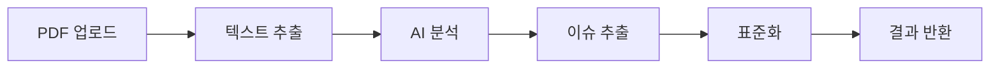

# PRD: ESG 중대성 이슈 자동 추출 API

## 📋 문서 정보
- **버전**: v1.0 MVP
- **작성일**: 2025-01-09
- **대상**: ESG 담당자, 지속가능경영 팀
- **목표**: 수작업 중대성 이슈 분석을 자동화하여 업무 효율성 극대화

---

## 🎯 프로젝트 개요

### 비전 (Vision)
**"ESG 담당자가 중대성 이슈 분석에 소요하는 시간을 90% 단축하고, 데이터 기반 전략 수립에 집중할 수 있도록 지원"**

### 미션 (Mission)
경쟁사 및 자사 ESG 보고서에서 중대성 이슈를 자동으로 추출하고 표준화하여, ESG 전략 수립의 효율성과 정확성을 혁신적으로 개선

---

## 💡 문제 정의 (Problem Statement)

### 현재 상황 (As-Is)
```
ESG 담당자의 연간 중대성 평가 프로세스
┌─────────────────────────────────────────────┐
│ 1. 경쟁사 ESG 보고서 수집 (10-20개 기업)         │
│    → 소요시간: 2-3일                           │
│                                             │
│ 2. 각 보고서에서 중대성 평가 섹션 수동 검색        │
│    → 소요시간: 1-2주 (150페이지/보고서)         │
│                                             │
│ 3. PDF → Excel 수기 복사/붙여넣기             │
│    → 소요시간: 1-2주                          │
│                                             │
│ 4. 서로 다른 분류 체계 수동 통합                │
│    → 소요시간: 3-5일                          │
│                                             │
│ 총 소요시간: 4-6주 (연간 2-3회 반복)            │
│ 연간 투입 시간: 240-540시간                    │
└─────────────────────────────────────────────┘
```

### 핵심 Pain Points
1. **시간 낭비**: 반복적인 수작업으로 인한 비효율성
2. **일관성 부족**: 기업마다 다른 표현 방식과 분류 체계
3. **정확성 문제**: 수작업으로 인한 누락 및 오류 발생
4. **확장성 한계**: 분석 대상 기업 수 증가 시 기하급수적 업무 증가
5. **전략적 가치 부족**: 단순 작업에 매몰되어 전략 수립 시간 부족

### 목표 상황 (To-Be)
```
자동화된 중대성 이슈 추출 프로세스
┌─────────────────────────────────────────────┐
│ 1. ESG 보고서 PDF 업로드                      │
│    → 소요시간: 5분                            │
│                                             │
│ 2. AI 기반 자동 중대성 이슈 추출               │
│    → 소요시간: 1-2분/보고서                   │
│                                             │
│ 3. 표준화된 JSON/Excel 결과 제공             │
│    → 소요시간: 즉시                           │
│                                             │
│ 4. 자동 분류 및 벤치마킹 분석                 │
│    → 소요시간: 즉시                           │
│                                             │
│ 총 소요시간: 1-2일 (연간 2-3회)               │
│ 연간 투입 시간: 16-24시간 (95% 절약)          │
└─────────────────────────────────────────────┘
```

---

## 🎯 비즈니스 목표 및 성공 지표

### 주요 목표 (Primary Goals)
1. **효율성 혁신**: 중대성 이슈 분석 시간 90% 이상 단축
2. **정확성 향상**: 수작업 대비 95% 이상 정확도 달성
3. **표준화 실현**: 일관된 분류 체계로 100% 표준화
4. **사용자 만족**: NPS 8점 이상 달성

### 성공 지표 (Success Metrics)
| 지표 | 현재 (As-Is) | 목표 (To-Be) | 측정 방법 |
|------|-------------|-------------|-----------|
| 처리 시간 | 4-6주 | 1-2일 | 실제 사용 시간 측정 |
| 정확도 | 70-80% | 95%+ | 전문가 검증 비교 |
| 표준화율 | 30-40% | 100% | 분류 일관성 측정 |
| 사용자 만족도 | - | NPS 8+ | 사용자 설문 조사 |
| ROI | - | 300%+ | 시간 절약 비용 환산 |

---

## 👥 타겟 사용자 (Target Users)

### Primary Users
**ESG 담당자 / 지속가능경영 팀**
- **역할**: 중대성 평가 수행, ESG 전략 수립
- **Pain Point**: 반복적 수작업, 시간 부족
- **기대 가치**: 업무 효율성, 전략적 인사이트

### Secondary Users
**ESG 컨설턴트 / 외부 전문가**
- **역할**: 다수 기업 ESG 분석 및 자문
- **Pain Point**: 대량 데이터 처리의 어려움
- **기대 가치**: 분석 속도 향상, 서비스 품질 개선

### Stakeholders
- **경영진**: ESG 전략 의사결정
- **IR팀**: 투자자 대상 ESG 성과 보고
- **감사팀**: ESG 리스크 모니터링

---

## 🔧 핵심 기능 요구사항 (Core Features)

### MVP 기능 (Phase 1)
#### 1. 파일 업로드 및 처리
```python
# 기능 명세
POST /api/v1/documents/upload
- 지원 형식: PDF (최대 50MB)
- 처리 시간: 60초 이내
- 동시 처리: 5개 파일
```

**사용자 스토리**:
> "ESG 담당자로서, 경쟁사 보고서 PDF를 드래그&드롭으로 업로드하면, 1분 내에 중대성 이슈가 자동 추출되기를 원한다."

#### 2. 중대성 이슈 자동 추출
```json
// 출력 형식
{
  "company": "삼성전자",
  "report_year": 2023,
  "materiality_issues": [
    {
      "issue_name": "기후변화 대응",
      "esg_category": "환경(E)",
      "stakeholder_interest": "높음",
      "business_impact": "높음",
      "priority_level": "핵심",
      "description": "탄소중립 목표 달성을 위한 재생에너지 확대",
      "confidence_score": 0.95,
      "source_page": 15
    }
  ],
  "total_issues": 12,
  "processing_time": "45초"
}
```

#### 3. 표준화된 분류 체계
- **ESG 카테고리**: 환경(E), 사회(S), 지배구조(G)
- **우선순위**: 핵심, 중요, 모니터링
- **이해관계자 관심도**: 높음, 보통, 낮음
- **비즈니스 영향도**: 높음, 보통, 낮음

#### 4. 결과 내보내기
- **JSON**: API 연동용
- **Excel**: 기존 워크플로우 연계
- **PDF 리포트**: 경영진 보고용

### 확장 기능 (Phase 2)
#### 1. 벤치마킹 분석
```python
# 경쟁사 비교 분석
GET /api/v1/analysis/benchmark
- 동종업계 이슈 트렌드
- 우선순위 비교 매트릭스
- Gap 분석 리포트
```

#### 2. 트렌드 분석
- 연도별 이슈 변화 추이
- 신규 이슈 감지
- 글로벌 표준 대비 분석

#### 3. 대시보드
- 실시간 처리 현황
- 분석 결과 시각화
- 사용 통계 및 ROI 측정

---

## 🏗️ 기술 아키텍처

### MVP 기술 스택
```python
# Backend
- FastAPI: REST API 서버
- Python 3.9+: 핵심 언어
- Unstructured: PDF 텍스트 추출
- Google Gemini: AI 기반 의미 분석

# Infrastructure  
- Docker: 컨테이너화
- AWS EC2: 서버 호스팅
- AWS S3: 파일 저장소
- PostgreSQL: 메타데이터 저장
```

### 처리 파이프라인


### 확장성 고려사항
1. **수평 확장**: 로드 밸런서 + 멀티 인스턴스
2. **성능 최적화**: 캐싱, 비동기 처리
3. **모니터링**: 로깅, 메트릭, 알림
4. **보안**: API 인증, 데이터 암호화

---

## 📊 비즈니스 모델

### 가치 제안 (Value Proposition)
1. **시간 절약**: 연간 200-500시간 절약 → **시급 5만원 기준 1,000-2,500만원 가치**
2. **정확성 향상**: 수작업 오류 95% 감소 → **의사결정 품질 개선**
3. **표준화**: 일관된 분석 기준 → **벤치마킹 신뢰성 향상**
4. **확장성**: 분석 대상 무제한 확장 → **전략적 인사이트 극대화**

### ROI 계산
```
연간 절약 비용:
- 시간 절약: 300시간 × 50,000원 = 15,000,000원
- 오류 감소: 재작업 비용 절약 = 3,000,000원
- 총 절약: 18,000,000원/년

시스템 운영 비용:
- 개발 비용: 30,000,000원 (초기)
- 운영 비용: 6,000,000원/년

ROI = (18,000,000 - 6,000,000) / 6,000,000 = 200%
```

---

## 🛣️ 개발 로드맵

### Phase 1: MVP (4-6주)
**목표**: 핵심 가치 검증 및 초기 사용자 확보

**Week 1-2: 기본 인프라**
- [ ] FastAPI 서버 구축
- [ ] PDF 업로드 API 개발
- [ ] 기본 텍스트 추출 구현

**Week 3-4: 핵심 기능**
- [ ] Gemini AI 연동
- [ ] 중대성 이슈 추출 로직
- [ ] 표준화 분류 체계 적용

**Week 5-6: 사용성 개선**
- [ ] 결과 내보내기 기능
- [ ] 에러 처리 및 안정성
- [ ] 사용자 테스트 및 피드백

### Phase 2: 확장 기능 (6-8주)
- [ ] 벤치마킹 분석 기능
- [ ] 대시보드 개발
- [ ] 성능 최적화
- [ ] 보안 강화

### Phase 3: 고도화 (8-12주)
- [ ] 트렌드 분석
- [ ] 머신러닝 모델 개선
- [ ] 글로벌 표준 대응
- [ ] 엔터프라이즈 기능

---

## 🎯 사용자 시나리오

### 시나리오 1: 연간 중대성 평가 수행
**배경**: ESG 팀장이 2024년 중대성 평가를 위해 경쟁사 15개 기업 분석 필요

**기존 방식**:
1. 각 기업 보고서 다운로드 (2일)
2. 중대성 섹션 수동 검색 (10일)
3. Excel 정리 및 표준화 (7일)
4. **총 소요시간: 19일**

**개선된 방식**:
1. 보고서 15개 일괄 업로드 (30분)
2. AI 자동 분석 대기 (15분)
3. 표준화된 결과 다운로드 (5분)
4. **총 소요시간: 1시간**

### 시나리오 2: 임시 경쟁사 분석
**배경**: 신규 경쟁사 진입으로 긴급 벤치마킹 필요

**기존 방식**: 2-3주 소요로 시의성 부족
**개선된 방식**: 1시간 내 완료로 즉시 대응 가능

---

## 📈 성공 요인 및 위험 관리

### 성공 요인 (Success Factors)
1. **사용자 중심 설계**: 실제 워크플로우 기반 UX
2. **정확도 우선**: 속도보다 신뢰성 확보
3. **점진적 개선**: 사용자 피드백 기반 지속 개선
4. **표준 준수**: 국제 ESG 표준 반영

### 주요 위험 및 대응 방안
| 위험 | 영향도 | 대응 방안 |
|------|--------|-----------|
| AI 정확도 부족 | 높음 | 전문가 검증, 지속적 모델 개선 |
| 사용자 저항 | 중간 | 점진적 도입, 교육 프로그램 |
| 기술적 복잡성 | 중간 | MVP 우선, 단계적 확장 |
| 경쟁사 등장 | 낮음 | 차별화 기능, 빠른 혁신 |

---

## 💰 예산 및 자원

### 개발 비용 (MVP)
- **개발자**: 2명 × 6주 = 24,000,000원
- **인프라**: AWS 비용 = 2,000,000원
- **AI API**: Gemini 사용료 = 1,000,000원
- **기타**: 테스트, 보안 등 = 3,000,000원
- **총 예산**: 30,000,000원

### 운영 비용 (연간)
- **서버 비용**: 3,600,000원
- **AI API 비용**: 1,800,000원
- **유지보수**: 600,000원
- **총 운영비**: 6,000,000원

---

## 📋 품질 기준

### 기능적 요구사항
- [ ] PDF 업로드 성공률 99% 이상
- [ ] 처리 시간 60초 이내
- [ ] 이슈 추출 정확도 95% 이상
- [ ] 분류 일관성 100%

### 비기능적 요구사항
- [ ] 동시 사용자 100명 지원
- [ ] 99.9% 가용성 (월 43분 이내 다운타임)
- [ ] 데이터 보안 ISO27001 준수
- [ ] API 응답시간 3초 이내

### 사용성 요구사항
- [ ] 사용법 학습 시간 30분 이내
- [ ] 직관적 인터페이스 (클릭 3회 이내 목표 달성)
- [ ] 모바일 반응형 지원
- [ ] 다국어 지원 (한국어, 영어)

---

## 🔄 피드백 및 개선 계획

### 사용자 피드백 수집
1. **베타 테스트**: 5개 기업 ESG 팀 대상
2. **사용성 테스트**: 월 1회 정기 실시
3. **만족도 조사**: 분기별 NPS 측정
4. **기능 요청**: 사용자 포털 운영

### 지속적 개선
1. **모델 업데이트**: 월 1회 정확도 개선
2. **기능 추가**: 분기별 신규 기능 릴리스
3. **성능 최적화**: 반기별 대규모 개선
4. **표준 업데이트**: 국제 표준 변경 시 즉시 반영

---

## 🎯 결론

이 PRD는 **ESG 담당자의 실질적인 업무 효율성 개선**에 초점을 맞춘 MVP 개발 계획입니다. 

**핵심 가치**:
- ⏰ **시간 절약**: 4-6주 → 1-2일 (95% 단축)
- 🎯 **정확성**: 수작업 대비 95% 이상 정확도
- 📊 **표준화**: 일관된 분류 체계로 100% 표준화
- 💰 **ROI**: 연간 200% 이상 투자 수익률

**성공 지표**: NPS 8점 이상, 처리 시간 90% 단축, 정확도 95% 이상

이를 통해 ESG 담당자들이 단순 반복 작업에서 벗어나 **전략적 가치 창출**에 집중할 수 있는 환경을 만들어가겠습니다.

이 PRD는 기술적 복잡성보다는 **실제 비즈니스 가치 창출**에 집중했습니다. MVP로 시작하되 명확한 확장 경로를 제시하여, 사용자의 진짜 Pain Point를 해결하면서도 지속 가능한 성장이 가능하도록 설계했습니다.